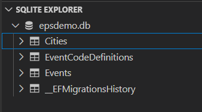
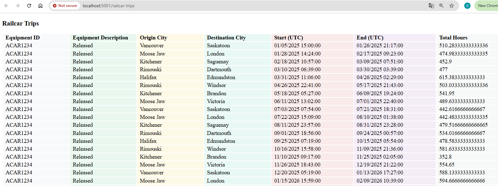

# Implemetaion, Discussion and TODO comments

## High Level – Senior Developer
- Designed and implemented a well-scoped Blazor WebAssembly solution that processes unordered, time zone–specific railcar events into persisted Trip parent entities, applying explicit domain rules (W = trip start, Z = trip end) and validating correctness through focused unit tests covering boundary conditions, ordering, and edge cases.
- Leveraged AI-assisted scaffolding to accelerate initial setup while independently designing, testing, and refining core domain logic, EF Core persistence, and processing workflows; adapted smoothly to tooling changes without compromising code quality or verification rigor.
- Demonstrated senior-level engineering judgment and communication by balancing scope, test coverage, and maintainability, and by clearly documenting assumptions, trade-offs, TODOs, and future enhancements to support team review and long-term evolution.

## Requirements align up
- Built a Blazor WebAssembly SPA with a server-side ASP.NET Core API; all data access handled via EF Core on the server.
- Designed a layered solution (Web, Server, Application, Domain, Infrastructure) to separate UI, trip-processing logic, and - persistence.
- Implemented a Railcar Trips page that uploads equipment_events.csv and triggers backend processing.
- Displayed processed trips in a data grid; optional drill-down shows ordered events for a selected trip.
- Used SQLite + EF Core migrations for fast demo setup, with design intentionally portable to SQL Server/Azure.
- Random checking of the final trip grid showed no overlapping times.
- 

## Discussion
- Should overlapping trips for the same equipment ever occur, or always sequential?
- Should partial trips without an end event be stored or ignored?
- Trips are currently generated (Demo.Server/Services/TripService.cs) by LINQ and cached rather than persisted as a parent entity with calculated fields (origin, destination, start/end UTC, total hours) and related events.
- I loaded csv data at server startup for simplicity, noting that alternatives include EF migration-based seeding (hard-coded data) or a proper ETL loader, with the trade-off that startup loading requires checking for existing records each time.
- Could keep DTOs in sync by either sharing a .NET library/project between backend and frontend, using NSwag/OpenAPI code generation to regenerate DTOs on schema changes, or manually copying files (least time for demo).
- Added logs on the server side, to cache backend process, exceptions etc, this could be big topic


## TODO comments
- Centralized the business rules using FluentValidation for the frontend and applied EF migrations for the database, keeping validation consistent and maintainable across the application.
- Improve UI/UX for trip-event drilldown (pagination, sorting).
- Wrote one unit test without diving too deep — just to get something in place for now.
- More checks on the final grid list — did a random check and didn’t find any overlapping times.
- Set up different environment configs for deployment — using Development as an example

# Demo Architecture
## Structure
```
Demo/
│
├── src/
│   ├── Demo.Web/                # Blazor WASM UI (grid, drill-down)
│   ├── Demo.Application/        # Application services (TripProcessor, DTOs)
│   ├── Demo.Domain/             # Domain entities, interfaces, logic
│   ├── Demo.Infrastructure/     # EF Core, data access, CSV seeding
│   └── Demo.Tests/              # Unit tests
│   └── Demo.Server/             # MVC API
│
├── Data/                           # CSV files (seed data)
└── README.md
```
## Database Deployment
To set up and deploy the database schema using EF Core migrations:
```sh
dotnet ef migrations add InitialCreate --project src/Demo.Infrastructure --startup-project src/Demo.Server
dotnet ef database update --project src/Demo.Infrastructure --startup-project src/Demo.Server
```

**Default: SQLite (Recommended for reviewers)**
- Extension to view db file https://marketplace.visualstudio.com/items?itemName=alexcvzz.vscode-sqlite

- The server will use SQLite by default for easy setup. The database file will be created at `Database/Demo.db`.
- taskkill /IM dotnet.exe /F

**To use SQL Server Express (as neded):**
- Set the environment variable `UseSqlite=false` or add `"UseSqlite": false` to your `appsettings.Development.json`.
- Optionally, set your own connection string in `ConnectionStrings:SqlExpress`.
- Example connection string: `Server=.\\SQLEXPRESS;Database=Demo;Trusted_Connection=True;MultipleActiveResultSets=true`

---
## Why Use Demo.Server for EF Core Migrations

- **Demo.Server.csproj** is required as the startup project for EF Core migrations because it contains the application's entry point, configuration, and dependency injection setup. It is used for running and applying migrations, not for direct database CRUD logic.
- **Demo.Infrastructure.csproj** contains the DbContext and entity definitions, and provides all database CRUD services for the application. Migrations are added here, but it cannot run or provide configuration by itself.
- **Demo.Web.csproj** is a Blazor WebAssembly project and cannot be used for migrations because it runs in the browser and does not support server-side EF Core operations.


## Event-to-Trip Grouping Logic

The following logic is used to group and assign events to trips based on event codes:
```
For each EquipmentId:
  currentTrip = null

  For each event in time order:
	if EventCode == "W":
		start new trip
		currentTrip = trip

	else if EventCode == "Z" AND currentTrip != null:
		end currentTrip
		currentTrip = null

	else:
		if currentTrip != null:
			attach event (A, D, etc.) to currentTrip
		else:
			ignore or store as orphan event
```

This logic ensures that trips are started with a "W" event, ended with a "Z" event, and all other events (such as "A", "D", etc.) are only attached to an active trip. Events outside of a trip are ignored or stored as orphans.

---
## Running the Web Project & Freeing Port 5001


```powershell
dotnet workload install wasm-tools
taskkill /IM dotnet.exe /F
dotnet watch --project src/Demo.Server/Demo.Server.csproj
dotnet watch --project src/Demo.Web/Demo.Web.csproj
```

- Result



